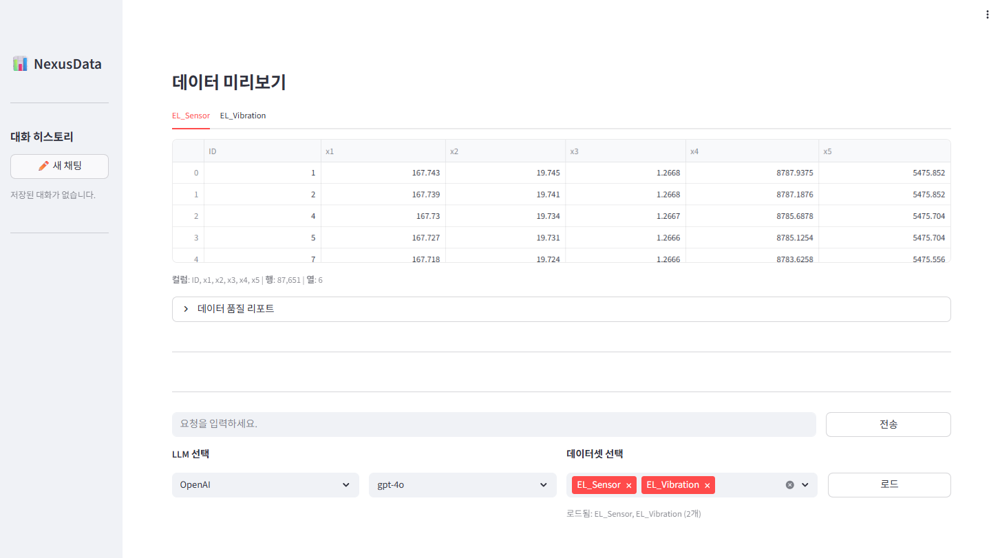
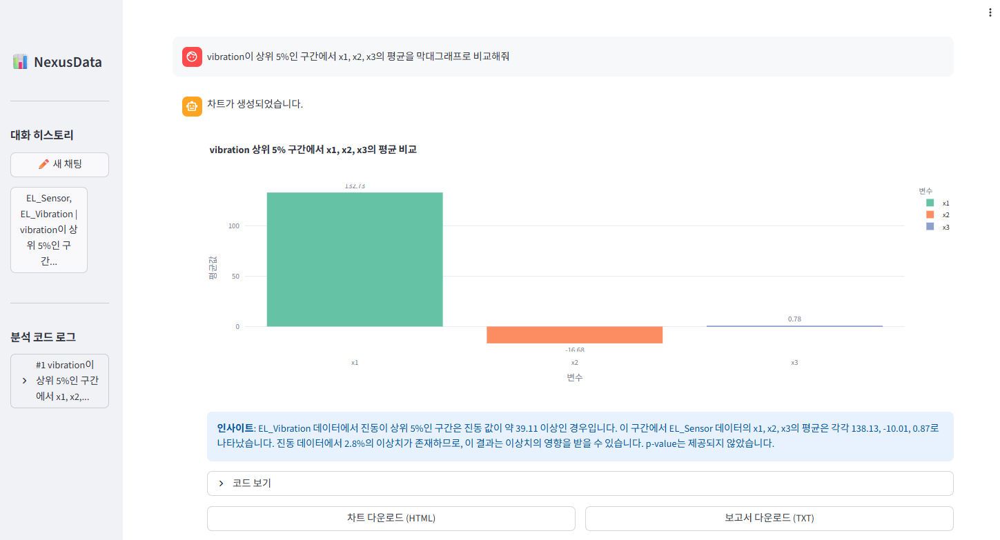
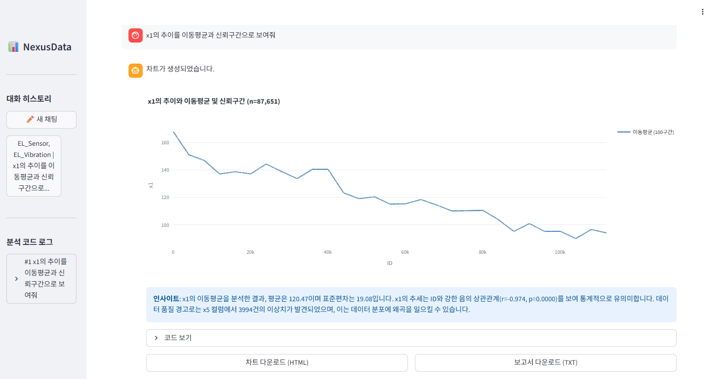
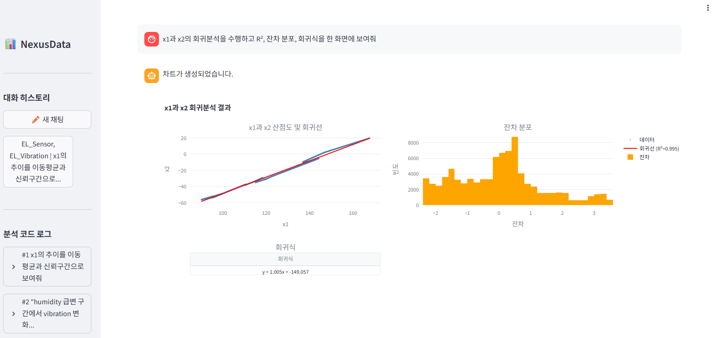
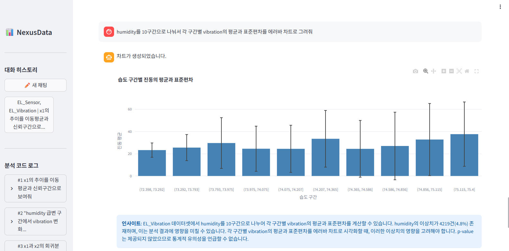
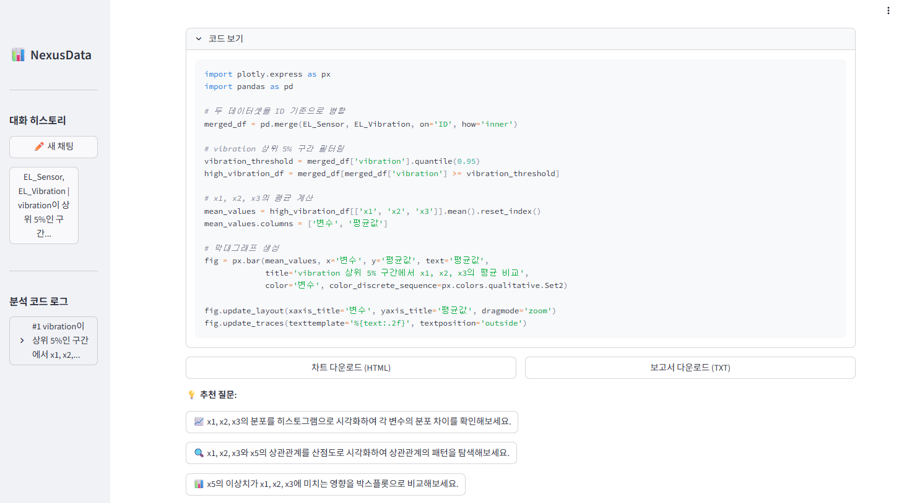

# 📊 NexusData

> **⚠️ 현재 Demo 버전입니다.**  
> Dataiku 내 EL_Sensor, EL_Vibration 데이터셋 기반으로 동작하며, 실제 운영 환경 배포 전 기능 검증 단계입니다.

Dataiku DSS 웹앱(Streamlit) 기반의 대화형 데이터 분석 도구.  
사용자의 자연어 질의를 LLM이 해석하여 Python 분석 코드를 자동 생성·실행하고, Plotly 인터랙티브 차트와 통계 인사이트를 제공합니다.

---

## 스크린샷

### 시작 화면


### 분석 화면









### 코드 보기 + 추천 질문


---

## 아키텍처

```
사용자 (자연어 질문)
    ↓
Streamlit UI (NexusData 웹앱)
    ↓
PromptEngine (프롬프트 조립)
    ↓
LLM (OpenAI / Claude / Groq)
    ↓
CodeValidator (보안 검증 + 자동 수정)
    ↓
CodeExecutor (샌드박스 실행, 60초 타임아웃)
    ↓
Plotly 차트 + 인사이트 + 추천 질문
```

## 주요 기능

- 자연어 → Plotly 차트 자동 생성 (scatter, heatmap, boxplot, histogram, regression 등)
- 멀티 데이터셋 지원 (Dataiku 프로젝트 내 여러 데이터셋 동시 로드, 병합 분석)
- 데이터 품질 리포트 (결측치, 이상치 IQR, 중복 행, Pearson p-value 자동 계산)
- 인사이트 자동 생성 (요청 변수가 속한 데이터셋 자동 매칭)
- 추천 질문 생성 (분석 맥락 기반 후속 질문 3개)
- 대화 히스토리 저장/불러오기
- 에러 자동 복구 (Self-Correction, 최대 2회 재시도)
- 실행 결과 캐싱 (MD5 해시 기반, 동일 요청 반복 시 API 비용 절감)

---

## 프롬프트 엔지니어링

### System Prompt 설계

LLM이 생성하는 코드의 품질과 안정성을 높이기 위해 시스템 프롬프트에 다음 규칙들을 설계:

| 영역 | 튜닝 내용 |
|------|-----------|
| 차트 라이브러리 강제 | Plotly 기본 사용, matplotlib은 사용자가 명시적으로 요청할 때만 |
| WebGL 가속 | `go.Scattergl` 강제, `render_mode='webgl'` — 11만건 데이터도 즉시 렌더링 |
| 차트 유형 가이드 | 요청 유형별 최적 차트 매핑 (추세→line, 관계→scatter, 분포→histogram+box 등) |
| 대용량 최적화 | 10k+ 데이터는 이동평균+신뢰구간만 표시, 원본 데이터 생략 |
| vrect 루프 금지 | `add_vrect` 반복 대신 `fill='tozeroy'` Scattergl 트레이스로 이상치 구간 표시 |
| 혼합 서브플롯 금지 | `imshow`(히트맵) + 히스토그램 혼합 시 크래시 방지 규칙 |
| deprecated 속성 금지 | `titlefont` → `title_font` 자동 치환 규칙 |
| fig.show() 금지 | Streamlit 환경에서 타임아웃 유발하므로 금지 |
| 보안 샌드박스 | os, sys, subprocess, open, eval, exec 등 위험 모듈/함수 차단 |
| 통계 리포트 시각화 강제 | print()만 하는 코드 방지, 반드시 fig 생성하도록 가이드 |

### Few-Shot Examples (11개)

LLM의 코드 생성 품질을 높이기 위해 실제 센서 데이터 분석 시나리오 기반 예제 11개 설계:

1. 산점도 (변수 관계) + WebGL
2. 밀도 히트맵 (대용량)
3. 회귀분석 (trendline + R²)
4. 시계열 추이 (이동평균 + ±2σ 신뢰구간 + 이상치 강조)
5. 히스토그램 + 박스플롯 (분포)
6. 박스플롯 (다변수 이상치 비교)
7. 상관관계 히트맵
8. 분포 비교 (오버레이 히스토그램)
9. 멀티 데이터셋 병합 + 그룹 비교
10. 복합 서브플롯 (박스플롯 + 산점도)
11. 이상치 구간 배경 강조 (vrect 대신 fill='tozeroy')
12. 통계 리포트 시각화 (변화율 상관계수 → 추이 + 산점도)

### 데이터셋 정보 자동 구축 (`build_dataset_info`)

LLM에 전달하는 컨텍스트를 자동으로 구축:
- 컬럼명, 타입, shape, 샘플 데이터 (5행)
- 기술통계 (describe)
- 결측치 비율, 중복 행 비율
- IQR 기반 이상치 탐지 (컬럼별 건수)
- Pearson 상관계수 + p-value 자동 계산 (|r|>0.3 기준)
- 날짜 컬럼 자동 감지
- 카테고리 컬럼 샘플값


### 멀티 데이터셋 인사이트 매칭

사용자 요청에 언급된 변수명/데이터셋명을 기준으로 해당 데이터셋의 통계를 자동 선택:
- 단일 데이터셋 언급 → 해당 데이터셋 통계만 사용
- 두 데이터셋 동시 언급 → 양쪽 통계 모두 포함
- 매칭 없음 → primary 데이터셋 기본 사용

### 데이터 품질 리포트

탭 전환 시 해당 데이터셋의 품질 리포트를 실시간 표시:
- 결측치 비율 (10% 이상 경고)
- 이상치 비율 (2% 이상 경고)
- 중복 행 비율 (1% 이상 경고)

---

## 코드 안정성 (CodeValidator)

LLM이 생성한 코드를 실행 전에 자동 검증·수정:

| 검증/수정 | 설명 |
|-----------|------|
| 보안 패턴 차단 | os, sys, subprocess, open, eval, exec 등 17개 패턴 |
| 모듈 화이트리스트 | pandas, numpy, plotly, scipy, sklearn 등만 허용 |
| 컬럼명 검증 | AST 파싱으로 존재하지 않는 컬럼 사용 감지 |
| fig 변수 확인 | fig 할당 없으면 경고 |
| deprecated 자동 치환 | `titlefont` → `title_font` |
| scatter 자동 수정 | 산점도 요청인데 line 차트 생성 시 자동 변환 |
| 혼합 서브플롯 감지 | imshow + histogram 혼합 → 히트맵 단독 코드로 대체 |
| Interval 직렬화 수정 | `pd.cut` 결과에 `.astype(str)` 자동 추가 |
| .show() 제거 | `fig.show()` / `plt.show()` 자동 제거 |

---

## 코드 실행 (CodeExecutor)

- 스레드 기반 샌드박스 실행 (60초 타임아웃)
- MD5 해시 기반 결과 캐싱
- Plotly figure의 shape/annotation 개수 제한 (50개 초과 시 차단)
- Interval 객체 후처리 (JSON 직렬화 오류 방지)
- 에러 발생 시 유형별 가이드 메시지 제공

---

## 기술 스택

| 구분 | 기술 |
|------|------|
| 플랫폼 | Dataiku DSS 웹앱 (Streamlit) |
| 시각화 | Plotly (기본), Matplotlib, Seaborn |
| LLM | OpenAI GPT-4o, Anthropic Claude, Groq Llama |
| 데이터 | Pandas, NumPy, SciPy, scikit-learn |
| 보안 | AST 기반 코드 검증, 모듈 화이트리스트, 샌드박스 실행 |
